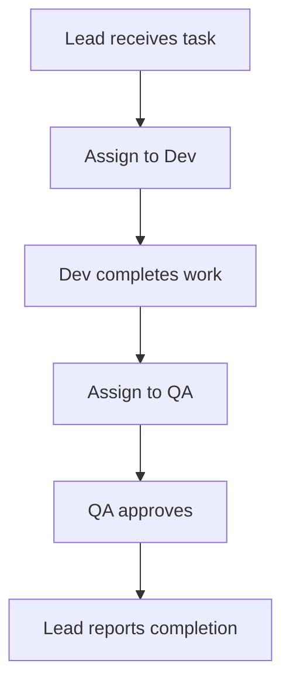
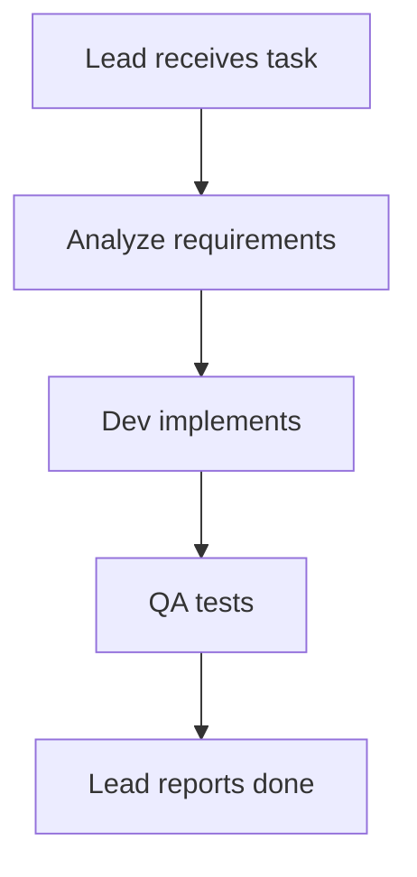
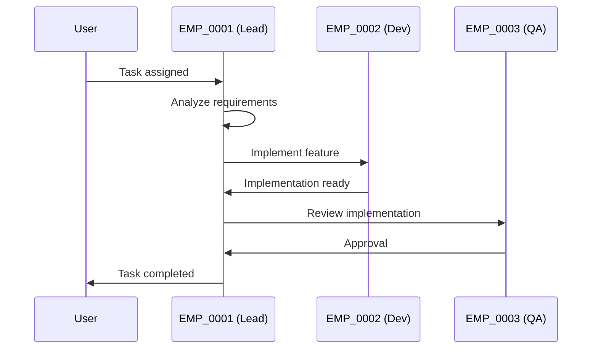
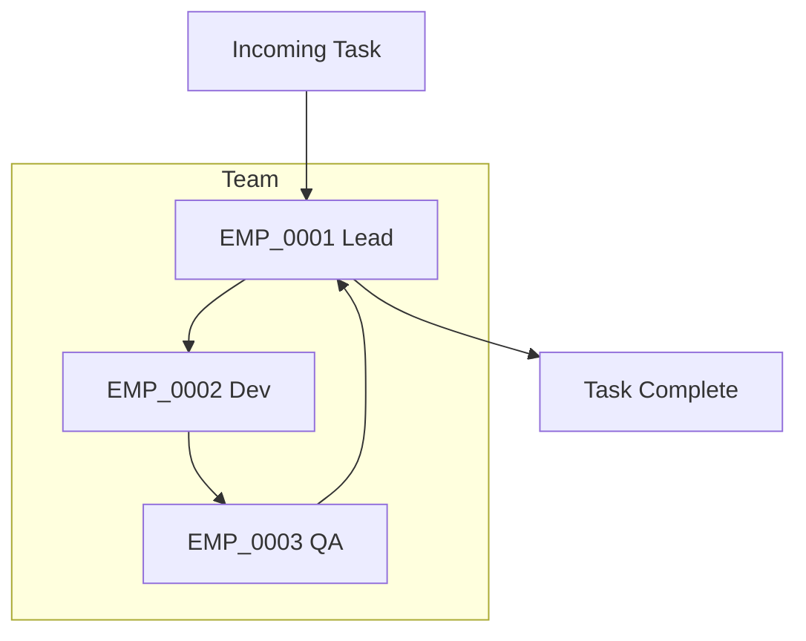
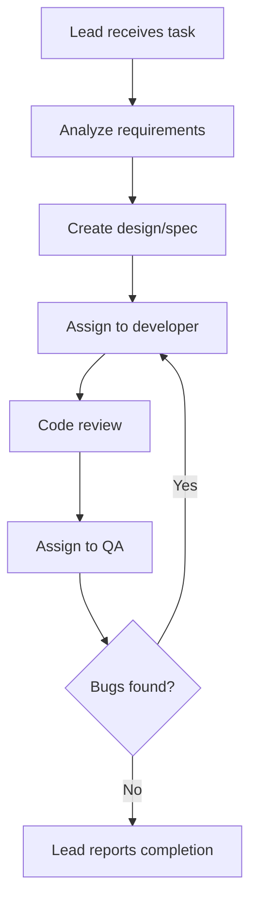
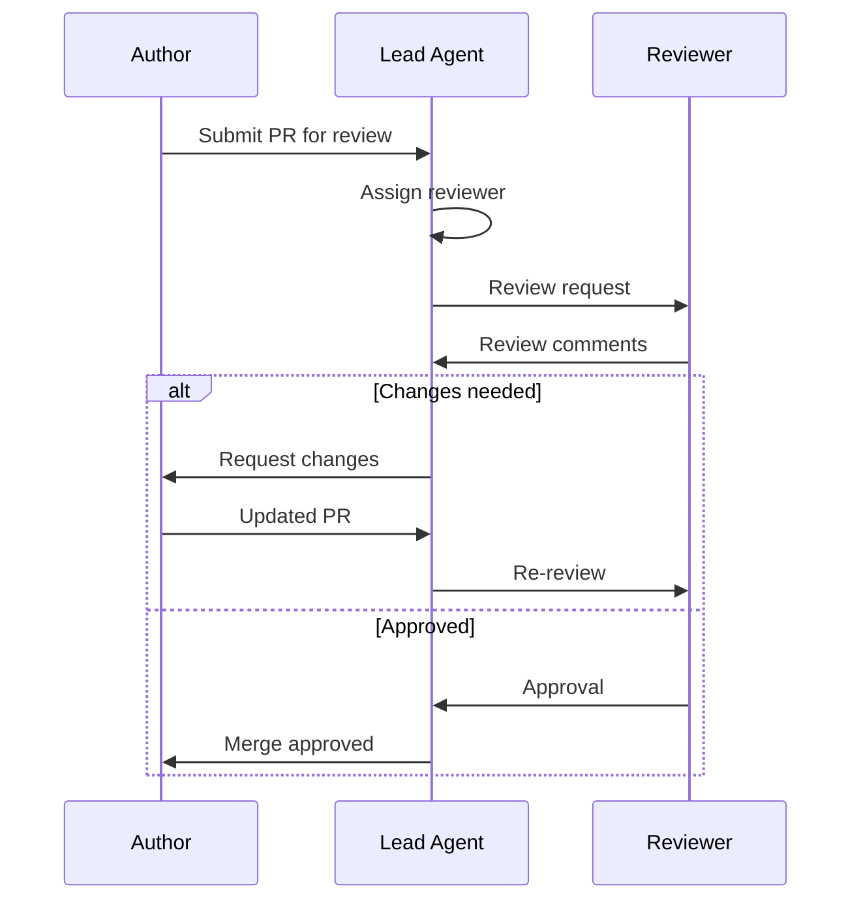

# Team Manager

Team orchestration system for managing multi-agent teams with lead-based coordination. Each team has a designated lead agent responsible for coordinating work among team members. Team members are referenced by their employee ID. Workflow is defined in the team configuration body using mermaid diagrams.

## Quick Start

```bash
# List all teams
python3 .agent/skills/team-manager/scripts/main.py list

# Show team details (including workflow)
python3 .agent/skills/team-manager/scripts/main.py show frontend

# Assign task to team
python3 .agent/skills/team-manager/scripts/main.py assign frontend <<EOF
Implement user authentication feature
EOF
# ⚠️ Important: tmux send-keys -t agent-EMP_0001 Enter

# Monitor team progress (live)
python3 .agent/skills/team-manager/scripts/main.py monitor frontend --follow

# Create a new team
python3 .agent/skills/team-manager/scripts/main.py create backend \\
    --lead EMP_0001 --members EMP_0001 EMP_0002 \\
    --description "Backend Development Team"
```

## Core Concepts

### Team Configuration

Teams are defined in `teams/TEAM_NAME.md` files. The YAML frontmatter contains team metadata, while the markdown body defines the workflow using mermaid diagrams.

```yaml
---
name: frontend
description: Frontend Development Team
lead_agent: EMP_0001
members:
  - employee_id: EMP_0001
    role: lead developer
  - employee_id: EMP_0002
    role: ui designer
  - employee_id: EMP_0003
    role: qa tester
---

# FRONTEND TEAM

## Workflow



### Coordination Process

1. **Lead Agent** (EMP_0001) receives task and analyzes requirements
2. Lead assigns work to appropriate team members
3. Members complete their assigned tasks
4. Lead reviews results and ensures quality
5. Lead reports completion with final results
```

**YAML Fields:**
- `name`: Team identifier (e.g., frontend, backend)
- `description`: Team purpose and responsibilities
- `lead_agent`: Employee ID of agent responsible for coordination (must be in members)
- `members`: List of team members with employee_id and role
- `working_directory`: (Optional) Working directory for all team members. Overrides individual agent working directories when team members are started for team tasks. Supports environment variables like `${REPO_ROOT}`.

**Body Content:**
- Markdown documentation
- Mermaid workflow diagrams
- Coordination process description
- Any additional team-specific information

### Employee IDs

Team members are referenced by their employee ID (e.g., `EMP_0001`). The employee ID corresponds to the agent file name in `agents/` directory:
- Agent file: `agents/EMP_0001.md`
- Employee ID: `EMP_0001`
- Agent name: The `name` field in the agent's YAML frontmatter

This decoupling allows agent names to change without breaking team configurations.

### Workflow with Mermaid

The workflow is defined in the team configuration body using mermaid diagrams. This allows flexible, visual representation of collaboration patterns.

**Common Mermaid Diagram Types:**

**Flowchart (graph TD/LR)** - Sequential workflows


**Sequence Diagram** - Agent interactions


**Subgraphs** - Team-based organization


### Lead Agent Responsibilities

When a task is assigned to a team, the lead agent:
1. Receives the team configuration including workflow documentation
2. Analyzes task requirements
3. Coordinates with team members following the defined workflow
4. Ensures quality and completeness
5. Reports back with final results

The lead agent uses agent-manager to interact with member agents.

## Commands

### `list` - List All Teams

Show all configured teams.

```bash
python3 .agent/skills/team-manager/scripts/main.py list
```

Output:
```
📋 Teams:

📦 frontend
   Description: Frontend Development Team
   Lead Agent: EMP_0001 (dev)
   Members: EMP_0001(lead developer), EMP_0002(ui designer), EMP_0003(qa tester)

📦 backend
   Description: Backend Development Team
   Lead Agent: EMP_0004 (backend-lead)
   Members: EMP_0004(api dev), EMP_0005(db admin)
```

### `show` - Show Team Details

Display detailed information about a specific team, including workflow.

```bash
python3 .agent/skills/team-manager/scripts/main.py show frontend
```

Shows:
- Team description and configuration
- Lead agent and members with roles (both employee ID and agent name)
- Full team documentation including mermaid workflow diagrams
- Validation errors (if any)

### `status` - Show Team Status

Show running/stopped status of all team members.

```bash
python3 .agent/skills/team-manager/scripts/main.py status frontend
```

Output:
```
📊 Team Status: frontend
============================================================
✅ Running EMP_0001 (dev) - lead developer 👑
⭕ Stopped EMP_0002 (ui-designer) - ui designer
✅ Running EMP_0003 (qa) - qa tester
```

### `assign` - Assign Task to Team

Assign a task to a team's lead agent for coordination.

```bash
# From stdin
python3 .agent/skills/team-manager/scripts/main.py assign frontend <<EOF
🎯 Task: Implement user authentication

1. Login page with form validation
2. JWT token management
3. Protected routes
4. Logout functionality
EOF

# ⚠️ Important: Send ENTER to trigger execution
tmux send-keys -t agent-EMP_0001 Enter

# From file
python3 .agent/skills/team-manager/scripts/main.py assign frontend --task-file task.md
```

The lead agent receives:
- Task description
- Team configuration (members with employee IDs and agent names)
- Team workflow documentation (including mermaid diagrams)
- Coordination instructions

### `monitor` - Monitor Team Output

View output from all team members.

```bash
# Snapshot (last 50 lines per agent)
python3 .agent/skills/team-manager/scripts/main.py monitor frontend

# Live monitoring (Ctrl+C to stop)
python3 .agent/skills/team-manager/scripts/main.py monitor frontend --follow

# Specify line count
python3 .agent/skills/team-manager/scripts/main.py monitor frontend -n 100
```

### `create` - Create New Team

Create a new team configuration file with a default mermaid workflow.

```bash
python3 .agent/skills/team-manager/scripts/main.py create backend \\
    --lead EMP_0001 \\
    --members EMP_0001 EMP_0002 EMP_0003 \\
    --description "Backend API Development Team"
```

Creates `teams/backend.md` with:
- YAML frontmatter configuration
- Default mermaid workflow diagram
- Team documentation template
- Usage examples

Use `--force` to overwrite existing team file.

## Architecture

```
.agent/skills/team-manager/
├── SKILL.md                    # This file
├── scripts/
│   ├── main.py                 # CLI entry point
│   └── team_config.py          # Team configuration parser
└── teams/                      # Team configuration files (created by user)
    ├── frontend.md
    └── backend.md
```

## Dependency on Agent-Manager

Team-manager depends on agent-manager for:
- Individual agent lifecycle (start/stop)
- Tmux session management
- Agent output monitoring
- Task assignment to agents
- Employee ID to agent name resolution

Team-manager extends agent-manager by:
- Grouping agents into teams
- Coordinating through lead agents
- Providing visual workflow definitions with mermaid

## Typical Workflow

### Setting Up a Team

1. **Create agents** in `agents/EMP_*.md` files (using agent-manager format)
2. **Create team** configuration with `create` command or manually
3. **Edit workflow** in the team file's body using mermaid
4. **Assign task** to team lead

### Editing Team Workflows

After creating a team, edit the workflow in `teams/TEAM_NAME.md`:

```bash
# Edit the workflow diagram
nano teams/frontend.md
```

Example workflow updates:
- Change from sequential to parallel execution
- Add approval steps
- Define conditional branches
- Add specific member assignments

### Assigning Work to a Team

```bash
# 1. Check team status
python3 .agent/skills/team-manager/scripts/main.py status frontend

# 2. Review workflow if needed
python3 .agent/skills/team-manager/scripts/main.py show frontend

# 3. Assign task (auto-starts lead agent if needed)
python3 .agent/skills/team-manager/scripts/main.py assign frontend <<EOF
Implement the feature...
EOF

# 4. Monitor progress
python3 .agent/skills/team-manager/scripts/main.py monitor frontend --follow

# 5. Send clarifications if needed
python3 .agent/skills/agent-manager/scripts/main.py send EMP_0001 "Please add error handling"
```

## Workflow Examples

### Sequential Development Workflow



### Parallel Feature Development

```mermaid
graph TD
    Start[Lead receives task] --> Breakdown[Break down into subtasks]
    Breakdown --> FE[Frontend task]
    Breakdown --> BE[Backend task]
    Breakdown --> DB[Database task]

    FE --> FE Done[Frontend complete]
    BE --> BE Done[Backend complete]
    DB --> DB Done[Database complete]

    FE Done --> Integration[Integrate all components]
    BE Done --> Integration
    DB Done --> Integration

    Integration --> QA[QA testing]
    QA --> Done[Lead reports completion]
```

### Code Review Workflow



## Error Handling

- **Team not found**: Lists available teams
- **Lead agent not configured**: Prompts to set lead_agent
- **Employee ID not found**: Shows error if agent doesn't exist in agents/
- **Members not running**: Shows status (assign auto-starts lead)
- **Invalid configuration**: Shows validation errors

## Best Practices

1. **Design clear workflows**: Use mermaid diagrams to visualize collaboration
2. **Empower the lead**: Lead agent should have coordination skills
3. **Define roles clearly**: Use member roles to clarify responsibilities
4. **Keep workflows current**: Update mermaid diagrams as processes evolve
5. **Monitor actively**: Use `monitor --follow` during active work
6. **Use employee IDs**: Always reference members by employee ID, not agent name
7. **Document thoroughly**: The body is for documentation - be detailed

## Installation

### via openskills (recommended)

```bash
# Project installation
openskills install fractalmind-ai/team-manager-skill

# Global installation
openskills install fractalmind-ai/team-manager-skill --global
```

### Manual installation

```bash
git clone https://github.com/fractalmind-ai/team-manager-skill.git
cp -r team-manager-skill ~/.claude/skills/team-manager
```

## Requirements

- agent-manager skill (install via: `openskills install fractalmind-ai/agent-manager-skill`)
- Agents defined in `agents/EMP_*.md` files
- Teams defined in `teams/TEAM_NAME.md` files

## Path Resolution

The skill automatically detects:
- **Skill Root**: Directory containing `SKILL.md`
- **Repo Root**: Parent directory containing `teams/` folder
- **Agent Manager**: Searches for agent-manager in `.claude/skills/` or `.agent/skills/`

This allows installation to any location.
