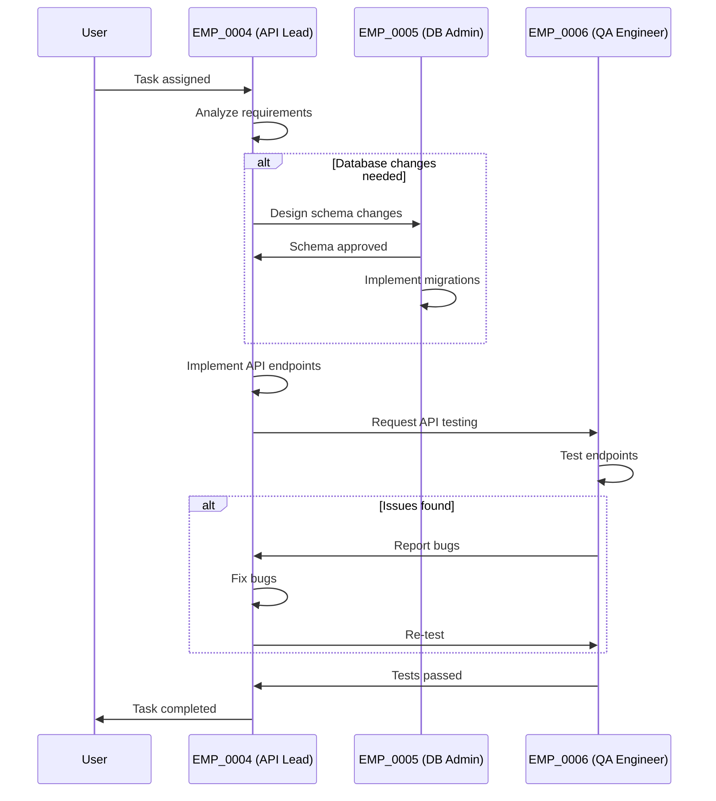

# Backend Team

## Description
Responsible for backend API development, database management, and API testing.

## Workflow



## Coordination Process

1. **Lead Agent** (EMP_0004) receives task and analyzes requirements
2. If database changes are needed, Lead works with DB Admin (EMP_0005) on schema
3. DB Admin implements database migrations
4. Lead implements API endpoints
5. QA Engineer (EMP_0006) tests the API endpoints
6. If issues are found, Lead fixes and re-submits for testing
7. Once all tests pass, Lead reports completion

## Team Members

- **EMP_0004** (backend-lead): api lead 👑
- **EMP_0005** (db-admin): database admin
- **EMP_0006** (qa): qa engineer

## Usage

Assign task to this team:
```bash
python3 .agent/skills/team-manager/scripts/main.py assign backend <<EOF
Implement user profile API endpoint
EOF
```

Monitor team progress:
```bash
python3 .agent/skills/team-manager/scripts/main.py monitor backend --follow
```
