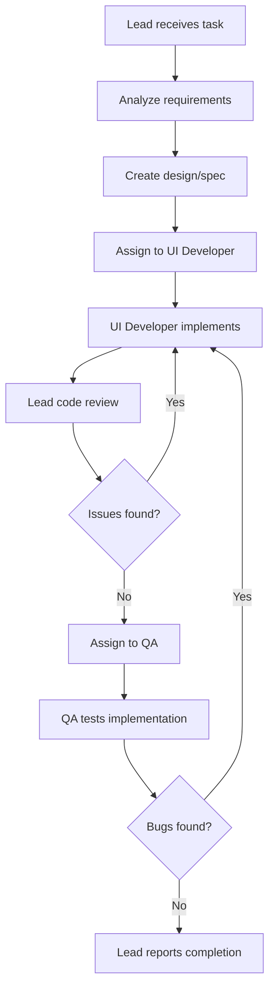

# Frontend Team

## Description
Responsible for frontend web application development, UI/UX implementation, and quality assurance.

## Workflow



## Coordination Process

1. **Lead Agent** (EMP_0001) receives task and analyzes requirements
2. Lead creates design/specification if needed
3. Lead assigns work to UI Developer (EMP_0002)
4. UI Developer implements the feature
5. Lead performs code review
6. QA (EMP_0003) tests the implementation
7. If bugs are found, return to UI Developer for fixes
8. Once approved, Lead reports completion

## Team Members

- **EMP_0001** (dev): lead developer 👑
- **EMP_0002** (ui-dev): ui developer
- **EMP_0003** (qa): qa tester

## Usage

Assign task to this team:
```bash
python3 .agent/skills/team-manager/scripts/main.py assign frontend <<EOF
Implement user login form with validation
EOF
```

Monitor team progress:
```bash
python3 .agent/skills/team-manager/scripts/main.py monitor frontend --follow
```
